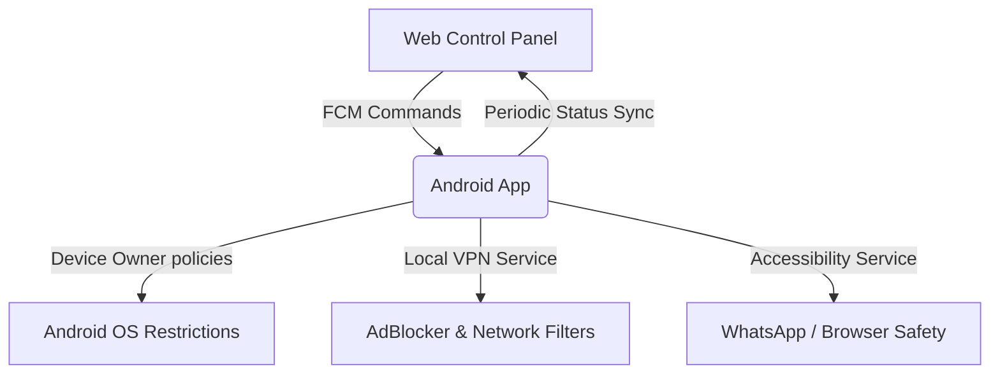

# LockSuite MDM - Enterprise Android Device Management & Control Panel

[English](#english) | [Español](#español)

---

## English

LockSuite MDM is a complete enterprise mobile device management (MDM) solution. It features a robust Android application implementing Android Device Owner capabilities and a web-based administration panel built on Firebase.

### Project Architecture



### Features

- **Device Owner Policies**: Prevent factory resets, disable app installation/uninstallation, block developer options (ADB), lock safe boot mode, and disable account modifications.
- **Hardware & UI Control**: Lock physical camera access, block screenshots, block status/notification bar, disable keyguard, and disable physical volume adjustments.
- **Connectivity Control**: Block Bluetooth, block USB OTG/SD media, disable WiFi hotspot (tethering), and disable VPN modifications.
- **AdBlock & Web Filtering**: Local custom VPN server resolving exact DNS hosts to block advertisements, web browsers, or complete internet access.
- **WhatsApp Restrictions**: accessibility-driven locking of WhatsApp Status and WhatsApp Channels.
- **Factory Reset Protection (FRP)**: Configure administrative Google Account bypass keys dynamically.
- **Language Localization**: Complete run-time dynamic translation in English, Spanish, and Hebrew.
- **Discreet UI & Stealth Mode**: Fully hidden launcher option and minimal login screen with settings drawer.

---

### Getting Started

#### 1. Web Panel Setup (`admin-backend`)
Prerequisites: Node.js (v18+), Firebase CLI.

1. Navigate to the backend directory:
   ```bash
   cd admin-backend
   ```
2. Install Cloud Functions dependencies:
   ```bash
   cd functions && npm install
   cd ..
   ```
3. Set your Firebase project:
   ```bash
   firebase use <YOUR-PROJECT-ID>
   ```
4. Deploy the application:
   ```bash
   firebase deploy --only hosting,database,functions
   ```

#### 2. Android App Setup (`app`)
Prerequisites: Android Studio, JDK 17.

1. Download your `google-services.json` from the Firebase Console and place it in the `app/` folder.
2. Open the project in Android Studio.
3. Configure your local keystore properties in `local.properties`:
   ```properties
   RELEASE_KEY_ALIAS=locksuite-alias
   RELEASE_KEY_PASSWORD=your_password
   RELEASE_STORE_FILE=path/to/keystore.jks
   RELEASE_STORE_PASSWORD=your_password
   ```
4. Compile and install using ADB:
   ```bash
   ./gradlew assembleRelease
   adb install app/build/outputs/apk/release/app-release.apk
   ```

#### 3. Provisioning Device Owner (FRP & Protection)
To provision the app as a Device Owner on Android, run the following ADB command:
```bash
adb shell dpm set-device-owner com.ejemplo.locksuite/com.ejemplo.locksuite.receiver.DeviceAdminReceiver
```

---

## Español

LockSuite MDM es una solución completa de administración de dispositivos móviles (MDM) corporativa. Cuenta con una robusta aplicación de Android que implementa capacidades de Device Owner (propietario de dispositivo) y un panel web de administración en tiempo real construido sobre Firebase.

### Características

- **Políticas de Device Owner**: Bloquea el formateo de fábrica, deshabilita la instalación/desinstalación de aplicaciones, bloquea opciones de desarrollo (ADB), desactiva el arranque seguro y la modificación de cuentas de Google.
- **Control de Hardware e Interfaz**: Desactiva el acceso a la cámara física, bloquea capturas de pantalla, deshabilita la barra de estado y notificaciones, bloquea ajustes de volumen físico.
- **Control de Conectividad**: Bloquea Bluetooth, bloquea medios externos (USB OTG/tarjetas SD), desactiva la zona WiFi (anclaje de red) y bloquea la configuración de VPNs externas.
- **Filtro Web y AdBlocker**: Servicio de VPN local que procesa hostnames DNS en O(1) para bloquear anuncios, navegadores o el internet completo.
- **Restricciones de WhatsApp**: Bloqueo inteligente de secciones de Estados y Canales utilizando accesibilidad de Android.
- **Protección de Restablecimiento (FRP)**: Registro de cuentas de Google autorizadas para desbloquear el equipo tras un formateo de fábrica.
- **Selector de Idioma**: Soporte multi-idioma integrado en tiempo real (Español, Inglés y Hebreo).

---

### Configuración e Instalación

#### 1. Panel de Control Web (`admin-backend`)
Requisitos: Node.js (v18+), Firebase CLI.

1. Entra al directorio del backend:
   ```bash
   cd admin-backend
   ```
2. Instala dependencias de las Cloud Functions:
   ```bash
   cd functions && npm install
   cd ..
   ```
3. Configura tu proyecto Firebase:
   ```bash
   firebase use <TU-PROJECT-ID>
   ```
4. Despliega en la nube:
   ```bash
   firebase deploy --only hosting,database,functions
   ```

#### 2. Aplicación Android (`app`)
Requisitos: Android Studio, JDK 17.

1. Descarga el archivo `google-services.json` de tu consola Firebase y colócalo en `app/`.
2. Importa el proyecto en Android Studio.
3. Define los accesos locales de firma en `local.properties`:
   ```properties
   RELEASE_KEY_ALIAS=locksuite-alias
   RELEASE_KEY_PASSWORD=tu_contraseña
   RELEASE_STORE_FILE=ruta/a/la/llave.jks
   RELEASE_STORE_PASSWORD=tu_contraseña
   ```
4. Compila la app:
   ```bash
   ./gradlew assembleRelease
   ```

#### 3. Asignar Permiso de Propietario (Device Owner)
Una vez instalada la app en el dispositivo (sin ninguna cuenta de Google configurada aún), ejecuta el siguiente comando ADB para habilitar los controles de bajo nivel:
```bash
adb shell dpm set-device-owner com.ejemplo.locksuite/com.ejemplo.locksuite.receiver.DeviceAdminReceiver
```
